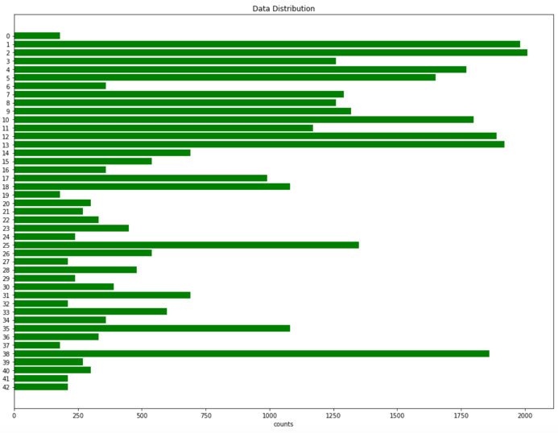
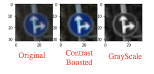
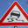
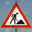
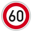

# **Traffic Sign Recognition** 

### Writeup / README

### Data Set Summary & Exploration

#### 1. Provide a basic summary of the data set. In the code, the analysis should be done using python, numpy and/or pandas methods rather than hardcoding results manually.

I used just the basic numpy library to calculate summary statistics of the traffic
signs data set:

Number of training examples = 34799
Number of testing examples = 12630
Image data shape = (32, 32, 3)
Number of classes = 43

* The size of training set is 34799
* The size of the validation set is 4410
* The size of test set is 12630
* The shape of a traffic sign image is (32, 32, 3)
* The number of unique classes/labels in the data set is 43

#### 2. Include an exploratory visualization of the dataset.

Here is an exploratory visualization of the data set. It is a bar chart showing how the data is distributed not uniformly.

### Design and Test a Model Architecture

#### 1. Describe how you preprocessed the image data. What techniques were chosen and why did you choose these techniques? Consider including images showing the output of each preprocessing technique. Pre-processing refers to techniques such as converting to grayscale, normalization, etc. (OPTIONAL: As described in the "Stand Out Suggestions" part of the rubric, if you generated additional data for training, describe why you decided to generate additional data, how you generated the data, and provide example images of the additional data. Then describe the characteristics of the augmented training set like number of images in the set, number of images for each class, etc.)

As a first step, I decided to boost the contrast since many images are taken from under dark conditions or is blur to tell.

As a second step, I convert the images to grayscale because additional color space might increase the burden for the neural network to compute.

As a third step, I add random noise pixels on the image to predict overfitting. This process can be skipped by giving an parameter of withNoise=False. Because validation and test dataset do not need to have noise on them.

As a last step, I normalized the image data because keeping the images array between -1 to 1 will help the neural network converge faster.

I decided to generate additional data because the number of different label are not equal. 

To add more data to the the data set, I just copy the images in the training data set until the numbers of all labels are the same. I considered more sophisticated techniques to generate fake data by making random rotation and scales. But implementing this trick needs to deal with one image a time. The cost is huge and the process is going to take forever so I give up. And the duplicated images work just fine.

Here is an example of an original image and the augmented image:

The processed image data has a shape of 32*32*1 now. 

#### 2. Describe what your final model architecture looks like including model type, layers, layer sizes, connectivity, etc.) Consider including a diagram and/or table describing the final model.

My final model consisted of the following layers:

| Layer         		|     Description	        					| 
|:---------------------:|:---------------------------------------------:| 
| Input         		| 32x32x1 Grayscale image   							| 
| Convolution 3x3   | 5x5 stride, valid padding, outputs 28x28x24 |
| RELU					|		|
| Max pooling	      | 2x2 stride,  outputs 14x14x24 |
| Convolution 3x3   | 3x3 stride, valid padding, outputs 12x12x96 |
| RELU					|		|
| Max pooling	      | 2x2 stride,  outputs 6x6x96 |
| Convolution 3x3   | 3x3 stride, valid padding, outputs 4x4x384 |
| RELU					|		|
| Max pooling	      | 2x2 stride,  outputs 2x2x384 |
| flatten	      | outputs 1536 |
| Fully connected		| inputs 1536,  outputs 512 |
| RELU					|		|
| Fully connected		| inputs 512,  outputs 128 |
| RELU					|		|
| Fully connected		| inputs 128,  outputs 43 |

#### 3. Describe how you trained your model. The discussion can include the type of optimizer, the batch size, number of epochs and any hyperparameters such as learning rate.

To train the model, I used an following hyperparameters:
- Optimizer: AdamOptimizer
- Batch size: 128
- Epochs: 10
- Learning rate: 0.001

#### 4. Describe the approach taken for finding a solution and getting the validation set accuracy to be at least 0.93. Include in the discussion the results on the training, validation and test sets and where in the code these were calculated. Your approach may have been an iterative process, in which case, outline the steps you took to get to the final solution and why you chose those steps. Perhaps your solution involved an already well known implementation or architecture. In this case, discuss why you think the architecture is suitable for the current problem.

My final model results were:
* validation set accuracy of 95.7% 
* test set accuracy of 93.6%

I added an additional conv layer and more channels to the final fully connect layers due to original underfitting performance (89% accuracy on validation dataset). 

The amount of noise added is tested several times. Too much noise will yield a low accuracy after the training.

The final results of this model gives an accuracy over 93% on both validation dataset and test dataset. So this model should work fine on new images.
 

### Test a Model on New Images

#### 1. Choose five German traffic signs found on the web and provide them in the report. For each image, discuss what quality or qualities might be difficult to classify.

  
 

The first image might be difficult to classify because this picture is taken with an angle facing upwards which made some distortions on the sign.

#### 2. Discuss the model's predictions on these new traffic signs and compare the results to predicting on the test set. At a minimum, discuss what the predictions were, the accuracy on these new predictions, and compare the accuracy to the accuracy on the test set (OPTIONAL: Discuss the results in more detail as described in the "Stand Out Suggestions" part of the rubric).

Here are the results of the prediction:

| Image			        |     Prediction	        					| 
|:---------------------:|:---------------------------------------------:| 
| Slippery Road      		| Slippery Road | 
| Road Work     			| Road Work |
| No Passing Sign					| No Passing Sign											|
| 60 km/h	      		| 60 km/h					 				|
| Stop Sign			| Stop Sign	     							|

The model was able to correctly guess 5 of the 5 traffic signs, which gives an accuracy of 100%. This compares favorably to the accuracy on the test set of 93.6%.

#### 3. Describe how certain the model is when predicting on each of the five new images by looking at the softmax probabilities for each prediction. Provide the top 5 softmax probabilities for each image along with the sign type of each probability. (OPTIONAL: as described in the "Stand Out Suggestions" part of the rubric, visualizations can also be provided such as bar charts)

The code for making predictions on my final model is located in the 2nd cell from the bottom of the Ipython notebook.

For the first image, the model is not so sure that this is a Slippery Road  (probability of 0.21), and the image does contain a Slippery Road sign. The top five soft max probabilities were

| Probability         	|     Prediction	        					| 
|:---------------------:|:---------------------------------------------:| 
| .21         			| Slippery Road   									| 
| .18     				| No-Passing										|
| .16					| Round-about mandatory									|
| .09	      			| Go-straight or left					 				|
| .08				    | Wild-animal crossing							|

For the second image, the model is sure that this is a Road work (probability of 0.47), and the image does contain a Road work sign. The top five soft max probabilities were

| Probability         	|     Prediction	        					| 
|:---------------------:|:---------------------------------------------:| 
| .47         			| Road work									| 
| .27     				| Be-ware of ice or snow										|
| .14					| Dangerous curve to the right									|
| .07	      			| Bicycles crossing					 				|
| .06				    | Keep left							|

And for the third, forth and fifth image, the results are below the jupyter html file. So I will not duplicate every detail here in this writeup.

